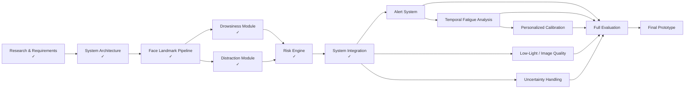

# AI-Based Driver Monitoring System
## Context-Aware Multimodal Driver Risk Assessment

> Innovative Design Project — VIT Chennai

---

## 1. Project Overview

The AI-Based Driver Monitoring System is a real-time computer-vision system designed to estimate driver risk by combining multiple observable behavioral indicators rather than relying on a single signal.

The system monitors:

- Eye closure and blink behavior
- Yawning / mouth opening
- Head pose
- Gaze / attention direction
- Visible phone usage
- Driving context
- Temporal behavior
- Combined risk patterns

The long-term goal is to transform these observations into a dynamic **Driver Risk Score (0–100)** and provide graduated alerts before the driver's condition becomes critical.

> **Important:** The system estimates observable driver risk. It does not directly measure the driver's internal cognitive state.

---

# 2. Project Status

### Current Progress

- [x] Problem definition
- [x] Literature review / research gap identification
- [x] System requirements analysis
- [x] System architecture design
- [x] Technology selection
- [x] GitHub repository setup
- [x] Project folder structure
- [x] MediaPipe Face Landmarker integration
- [x] Facial landmark detection
- [x] Eye landmark extraction
- [x] EAR calculation
- [x] Live EAR visualization
- [x] Eye open/closed classification
- [x] Blink detection
- [x] Eye-closure duration tracking
- [x] Prolonged eye-closure detection
- [x] MAR calculation
- [x] Live MAR visualization
- [x] Head-pose estimation
- [x] Basic gaze / attention estimation
- [x] Sustained looking-away detection
- [x] Context engine
- [x] Stationary vs moving context prototype
- [x] Risk engine
- [x] Dynamic 0–100 risk score
- [x] Risk-level classification
- [x] Risk recovery / decay
- [x] Person 1 + Person 2 + Person 3 integration prototype
- [ ] Alert manager integration
- [ ] Real-time graduated visual alerts
- [ ] Real-time audio alerts
- [ ] Eye-iris gaze integration and validation
- [ ] Phone detection integration
- [ ] Temporal fatigue trend analysis
- [ ] Personalized driver calibration
- [ ] Image-quality / low-light handling
- [ ] Uncertainty-aware risk estimation
- [ ] Full-system testing
- [ ] Threshold calibration
- [ ] False-positive / false-negative evaluation
- [ ] Performance evaluation
- [ ] Final dashboard / visualization
- [ ] Final documentation and experimental results

---

# 3. System Architecture

The overall system follows a modular multimodal pipeline:

```mermaid
flowchart TD

    A[Camera / Video Input]

    A --> B[Frame Acquisition]

    B --> C[Face Detection & Facial Landmarks]

    C --> D1[Eye & Drowsiness Module]
    C --> D2[Distraction & Context Module]
    C --> D3[Mouth / Yawning Module]

    D1 --> E1[EAR]
    E1 --> E2[Blink Detection]
    E2 --> E3[Eye Closure Duration]
    E3 --> E4[Prolonged Closure]

    D3 --> F1[MAR]
    F1 --> F2[Yawn Detection]

    D2 --> G1[Head Pose]
    D2 --> G2[Gaze / Attention]
    D2 --> G3[Phone Detection]
    D2 --> G4[Driving Context]

    E4 --> H[Temporal & Context Analysis]
    F2 --> H
    G1 --> H
    G2 --> H
    G3 --> H
    G4 --> H

    H --> I[Dynamic Risk Engine]

    I --> J[Driver Risk Score 0–100]

    J --> K{Risk Level}

    K --> L[Normal]
    K --> M[Low]
    K --> N[Medium]
    K --> O[High]

    L --> P[No Alert]
    M --> Q[Visual Warning]
    N --> R[Warning Alert]
    O --> S[Critical Alert]

    H --> T[Fatigue / Risk Trends]
    T --> I
````

---

# 4. Current Implemented Architecture

The currently implemented prototype can be represented as:

```mermaid
flowchart LR

    A[Webcam]

    A --> B[MediaPipe Face Landmarker]

    B --> C[Facial Landmarks]

    C --> D[Person 1<br/>Drowsiness]

    C --> E[Person 2<br/>Distraction & Context]

    D --> F[EAR / Blink / Closure / MAR]

    E --> G[Head Pose / Gaze / Context]

    F --> H[Person 3<br/>Risk Engine]

    G --> H

    H --> I[Risk Score<br/>0–100]

    I --> J[Risk Level]
```

### Current prototype flow

```text
Webcam
   ↓
Face Landmarks
   ↓
┌───────────────────────────┐
│                           │
│  Person 1                 │
│  Eye + Drowsiness         │
│                           │
│  EAR → Blink → Closure    │
│  MAR → Yawning            │
│                           │
└─────────────┬─────────────┘
              │
              │
              ▼
        ┌──────────────┐
        │              │
        │  Risk Engine │
        │              │
        │   0 – 100    │
        │              │
        └──────┬───────┘
               │
               ▲
              │
┌─────────────┴─────────────┐
│                           │
│  Person 2                 │
│  Distraction + Context    │
│                           │
│  Head Pose                │
│  Gaze / Attention         │
│  Context                  │
│  Phone Detection          │
│                           │
└───────────────────────────┘
               │
               ▼
        Risk Level
               │
       ┌───────┼────────┐
       ▼       ▼        ▼
    NORMAL    LOW    MEDIUM/HIGH
```

---

# 5. Module Breakdown

## Person 1 — Facial & Drowsiness Module

### Completed

* [x] Webcam frame processing
* [x] MediaPipe facial landmarks
* [x] Eye landmark extraction
* [x] Eye Aspect Ratio (EAR)
* [x] Eye state classification
* [x] Blink detection
* [x] Blink counting
* [x] Eye closure duration
* [x] Prolonged eye closure
* [x] Mouth landmark extraction
* [x] Mouth Aspect Ratio (MAR)

### Remaining

* [ ] Yawn detection
* [ ] Blink-frequency analysis
* [ ] Long-term fatigue trend
* [ ] Personalized EAR calibration
* [ ] Robustness testing under lighting/glasses/occlusion

---

## Person 2 — Distraction & Context Module

### Completed

* [x] Head-pose estimation
* [x] Pitch estimation
* [x] Yaw estimation
* [x] Roll estimation
* [x] Basic gaze / attention estimation
* [x] Looking-away detection
* [x] Sustained looking-away detection
* [x] Stationary vs moving context prototype
* [x] Context classification
* [x] Phone detector prototype

### In Progress

* [ ] Iris-based eyeball gaze
* [ ] Phone detector validation
* [ ] Phone + gaze combination
* [ ] More robust context classification

---

## Person 3 — Risk & System Integration

### Completed

* [x] Risk engine
* [x] 0–100 risk score
* [x] Risk levels
* [x] Risk smoothing
* [x] Risk recovery / decay
* [x] Integration of Person 1 outputs
* [x] Integration of Person 2 outputs
* [x] Initial real-time monitoring pipeline

### Remaining

* [ ] Alert manager
* [ ] Graduated alerts
* [ ] Audio alerts
* [ ] Risk visualization
* [ ] Temporal risk trends
* [ ] Uncertainty handling
* [ ] Final system validation

---

# 6. Risk Assessment Model

The system does not simply classify the driver as:

```text
SAFE / UNSAFE
```

Instead, it maintains a continuous risk score:

```text
             DRIVER STATE
                  │
                  ▼
       ┌─────────────────────┐
       │ Observable Signals  │
       └──────────┬──────────┘
                  │
       ┌──────────┼──────────┐
       ▼          ▼          ▼
   Drowsiness  Distraction  Context
       │          │          │
       └──────────┼──────────┘
                  ▼
          Temporal Analysis
                  │
                  ▼
           Risk Calculation
                  │
                  ▼
          ┌───────────────┐
          │ Risk: 0–100   │
          └───────┬───────┘
                  │
        ┌─────────┼─────────┐
        ▼         ▼         ▼
      NORMAL     LOW     MEDIUM/HIGH
```

The prototype currently uses rule-based scoring with smoothing and recovery.

> Risk weights and thresholds are preliminary prototype values and require calibration and experimental validation.

---

# 7. Context-Aware Risk Logic

The same behavior can have different meanings depending on context.

### Example

```text
Stationary
    +
Looking sideways
    ↓
Potentially normal
```

whereas:

```text
Vehicle moving
    +
Looking away continuously
    ↓
Distraction indicator
```

and:

```text
Vehicle moving
    +
Phone visible
    +
Looking away
    ↓
Higher combined risk
```

Similarly:

```text
Prolonged eye closure
        ↓
Drowsiness indicator
```

The fundamental principle is:

```text
RISK
  =
BEHAVIOR
  +
DURATION
  +
CONTEXT
  +
TEMPORAL PATTERN
```

---

# 8. Repository Structure

```text
driverdrowsiness/
│
├── README.md
├── requirements.txt
├── .gitignore
│
├── models/
│   └── face_landmarker.task
│
├── src/
│   │
│   ├── camera/
│   │   └── webcam.py
│   │
│   ├── face/
│   │   └── face_landmarks.py
│   │
│   ├── eyes/
│   │   ├── __init__.py
│   │   ├── ear.py
│   │   ├── eye_state.py
│   │   └── blink_detector.py
│   │
│   ├── drowsiness/
│   │   └── closure_detector.py
│   │
│   ├── mouth/
│   │   ├── __init__.py
│   │   ├── mar.py
│   │   └── mouth_state.py
│   │
│   ├── distraction/
│   │   ├── head_pose.py
│   │   ├── gaze.py
│   │   ├── eye_gaze.py
│   │   ├── context.py
│   │   ├── phone_detector.py
│   │   └── run_demo.py
│   │
│   ├── risk/
│   │   ├── __init__.py
│   │   ├── risk_engine.py
│   │   └── alert_manager.py
│   │
│   └── integration/
│       ├── __init__.py
│       └── driver_monitor.py
│
├── tests/
│   ├── __init__.py
│   ├── test_ear.py
│   ├── test_mar.py
│   ├── test_blink_closure.py
│   ├── test_eye_gaze.py
│   └── test_risk_engine.py
│
├── data/
│   └── test_videos/
│
└── outputs/
    └── screenshots/
```

---

# 9. Development Roadmap



---

# 10. Testing Strategy

### Unit Testing

* [x] EAR calculation
* [x] MAR calculation
* [x] Blink detection
* [x] Closure detection
* [x] Risk engine

### Module Testing

* [x] Face landmark detection
* [x] Eye tracking
* [x] Head pose
* [x] Basic gaze
* [x] Context engine

### Integration Testing

* [x] Person 1 + Risk Engine
* [x] Person 2 + Risk Engine
* [x] Person 1 + Person 2 + Person 3

### Final Evaluation

* [ ] Normal driving
* [ ] Prolonged eye closure
* [ ] Frequent blinking
* [ ] Yawning
* [ ] Looking away
* [ ] Phone usage
* [ ] Multiple simultaneous indicators
* [ ] Stationary vehicle
* [ ] Different lighting conditions
* [ ] Glasses / partial occlusion
* [ ] Different users
* [ ] False-positive analysis
* [ ] False-negative analysis

---

# 11. How to Run

### Install dependencies

```bash
python -m pip install -r requirements.txt
```

### Test EAR

```bash
python -m tests.test_ear
```

### Test MAR

```bash
python -m tests.test_mar
```

### Test blink and closure detection

```bash
python -m tests.test_blink_closure
```

### Test eye gaze

```bash
python -m tests.test_eye_gaze
```

### Test risk engine

```bash
python -m tests.test_risk_engine
```

### Run distraction module

```bash
python -m src.distraction.run_demo
```

### Run integrated driver monitoring system

```bash
python -m src.integration.driver_monitor
```

---

# 12. Technology Stack

| Component            | Technology                |
| -------------------- | ------------------------- |
| Language             | Python                    |
| Computer Vision      | OpenCV                    |
| Facial Landmarks     | MediaPipe Face Landmarker |
| Numerical Processing | NumPy                     |
| Head Pose            | OpenCV solvePnP           |
| Object Detection     | YOLO                      |
| Alerts               | Pygame                    |
| Version Control      | Git / GitHub              |

---

# 13. Current Prototype Limitations

* Camera-based observation cannot directly measure cognitive state.
* Gaze direction is not equivalent to attention.
* Phone detection depends on visibility and detector performance.
* Facial landmarks can degrade under poor lighting or occlusion.
* Fixed thresholds may not generalize equally across users.
* Head movements can have legitimate driving-related causes.
* Risk weights currently require empirical calibration.
* The current moving/stationary state is a prototype input and is not yet obtained from actual vehicle telemetry.
* The system is currently designed as a research/prototype system rather than a safety-certified automotive product.

---

# 14. Future Development

```text
Current Prototype
       ↓
Multimodal Observation
       ↓
Temporal Behaviour Modeling
       ↓
Personalized Calibration
       ↓
Context-Aware Risk Prediction
       ↓
Uncertainty Estimation
       ↓
Fatigue Trend Prediction
       ↓
Adaptive Alerts
       ↓
Vehicle / Sensor Integration
       ↓
Robust Real-World Evaluation
```

---

# 15. Long-Term Vision


The long-term objective is to move from simple event detection toward **continuous, context-aware and personalized driver-risk assessment**, where the system identifies increasing risk early and responds proportionally rather than waiting for a critical event.


