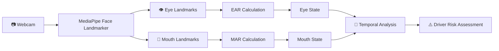

# 🚗 AI-Based Driver Monitoring System

### Context-Aware Multimodal Driver Risk Assessment

> An AI-based driver monitoring system that analyzes observable facial and behavioral cues to identify potential driver fatigue and distraction in real time..

---

## 🎯 Project Vision

The system aims to move beyond simple **"eyes closed = drowsy"** detection by combining multiple observable signals over time.

```text
             📷 Camera
                 │
                 ▼
        ┌─────────────────┐
        │ Face Landmarker │
        └────────┬────────┘
                 │
        ┌────────┴─────────┐
        ▼                  ▼
   👁 Eye Analysis     👄 Mouth Analysis
        │                  │
        ▼                  ▼
       EAR                MAR
        │                  │
   Eye Closure          Yawning
        │                  │
        └────────┬─────────┘
                 ▼
        🧠 Risk Assessment
                 │
                 ▼
       ⚠️ Driver Risk Score
````

---

## 🚧 Current Progress

### Implemented

* ✅ Real-time webcam capture
* ✅ MediaPipe Face Landmarker
* ✅ Real-time facial landmark tracking
* ✅ Eye landmark extraction
* ✅ Eye Aspect Ratio (EAR) calculation
* ✅ Mouth landmark extraction
* ✅ Mouth Aspect Ratio (MAR) calculation
* ✅ Modular project structure
* ✅ Individual test programs for EAR and MAR

### In Progress

* 🔄 Eye open/closed classification
* 🔄 Blink detection
* 🔄 Prolonged eye-closure detection
* 🔄 Yawn detection
* 🔄 Temporal fatigue analysis
* 🔄 Multimodal risk scoring

### Planned

* ⏳ Gaze/attention estimation
* ⏳ Head-pose analysis
* ⏳ Phone-use detection
* ⏳ Context-aware risk assessment
* ⏳ Graduated alerts
* ⏳ Personalized calibration

---

## 🏗️ Project Structure

```text
driverdrowsiness/
│
├── 📁 models/
│   └── face_landmarker.task
│
├── 📁 src/
│   ├── 📁 camera/
│   │   └── webcam.py
│   │
│   ├── 📁 face/
│   │   ├── __init__.py
│   │   └── face_landmarks.py
│   │
│   ├── 📁 eyes/
│   │   ├── __init__.py
│   │   ├── ear.py
│   │   ├── eye_state.py
│   │   └── blink_detector.py
│   │
│   ├── 📁 mouth/
│   │   ├── mar.py
│   │   ├── mouth_state.py
│   │   └── yawn_detector.py
│   │
│   ├── 📁 drowsiness/
│   │   └── closure_detector.py
│   │
│   └── 📁 utils/
│       ├── drawing.py
│       └── config.py
│
├── 📁 tests/
│   ├── test_ear.py
│   └── test_mar.py
│
├── 📄 requirements.txt
├── 📄 README.md
└── 📄 .gitignore
```

### Module Responsibilities

| Module        | Purpose                         | Status |
| ------------- | ------------------------------- | ------ |
| `camera/`     | Webcam/video input              | 🟢     |
| `face/`       | Face landmark detection         | 🟢     |
| `eyes/`       | EAR and eye behavior analysis   | 🟢     |
| `mouth/`      | MAR and mouth behavior analysis | 🟢     |
| `drowsiness/` | Temporal drowsiness detection   | 🟡     |
| `utils/`      | Shared utilities/configuration  | 🟡     |
| `tests/`      | Module-level testing            | 🟢     |
| `models/`     | MediaPipe model assets          | 🟢     |

---

## 🛠️ Tech Stack

| Technology             | Role                                |
| ---------------------- | ----------------------------------- |
| 🐍 **Python**          | Core development                    |
| 👁️ **MediaPipe**      | Face landmark detection             |
| 📷 **OpenCV**          | Webcam & real-time video processing |
| 🔢 **NumPy**           | Numerical computation               |
| 📐 **EAR**             | Eye closure/blink measurement       |
| 👄 **MAR**             | Mouth opening/yawning measurement   |
| 🧠 **Computer Vision** | Driver behavior analysis            |
| 🔧 **Git & GitHub**    | Version control                     |

---

## 🔬 Current Detection Pipeline

### Eye Analysis

```text
Face Landmarks
      ↓
Eye Landmarks
      ↓
     EAR
      ↓
┌───────────────┐
│ Eye Behaviour │
├───────────────┤
│ 👁 Open       │
│ 😑 Closed     │
│ ⚡ Blink      │
│ ⏱ Prolonged   │
└───────────────┘
```

### Mouth Analysis

```text
Face Landmarks
      ↓
Mouth Landmarks
      ↓
     MAR
      ↓
┌────────────────┐
│ Mouth Behaviour│
├────────────────┤
│ Normal         │
│ Open           │
│ 🥱 Yawning     │
└────────────────┘
```

---

## 📊 System Architecture



---

## 🧪 Running the Tests

Activate the virtual environment:

```bash
.venv\Scripts\activate
```

Test facial landmarks:

```bash
python src/test_face.py
```

Test EAR:

```bash
python -m tests.test_ear
```

Test MAR:

```bash
python -m tests.test_mar
```

Press **`Q`** to close the webcam windows.

---

## 📈 Core Metrics

### EAR — Eye Aspect Ratio

Measures the relative vertical opening of the eye.

```text
Higher EAR  → 👁 More open
Lower EAR   → 😑 More closed
```

### MAR — Mouth Aspect Ratio

Measures mouth opening relative to mouth width.

```text
Lower MAR   → Normal / closed mouth
Higher MAR  → 👄 Open mouth
Sustained high MAR → Potential yawn
```

> Thresholds will be calibrated and validated experimentally rather than treated as universal constants.

---

## 👥 Team

| Member              | ID        |
| ------------------- | --------- |
| **Jaagriti Mandal** | 25BCE5105 |
| **Ashita Kuchhal**  | 25BCE5186 |
| **Aneesha Yadav**   | 25BCE5590 |

**Faculty In-Charge:** Dr. Rama Prabha K. P.

**Institution:** Vellore Institute of Technology, Chennai

---

## 🚀 Long-Term Vision

```text
📷 Camera
   ↓
🤖 AI Perception
   ↓
👁️ Driver Behaviour
   ↓
🧠 Temporal + Context Analysis
   ↓
📊 Risk Assessment
   ↓
⚠️ Preventive Intervention
```

**Goal:** Build a multimodal, context-aware system that estimates increasing observable driver risk before it develops into a critical situation.

```
```
